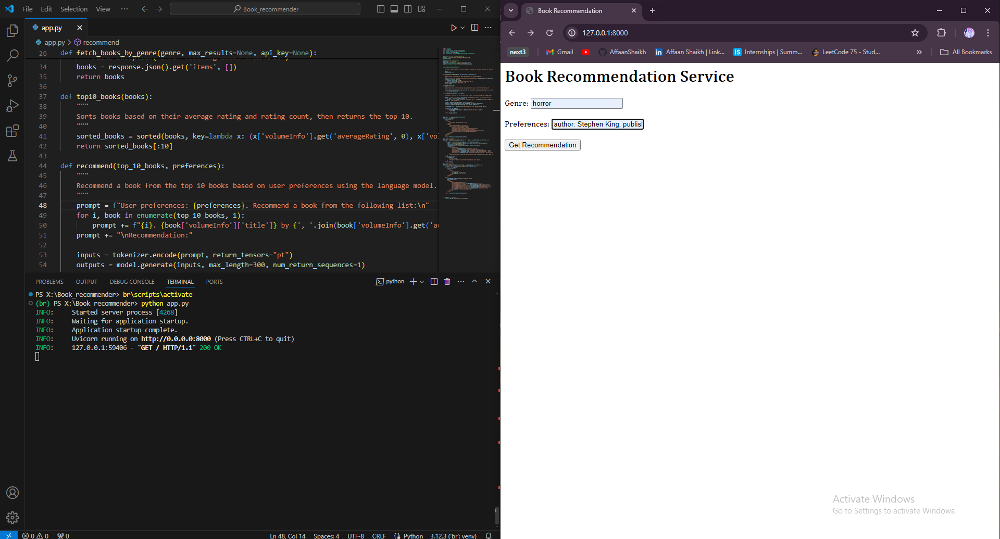
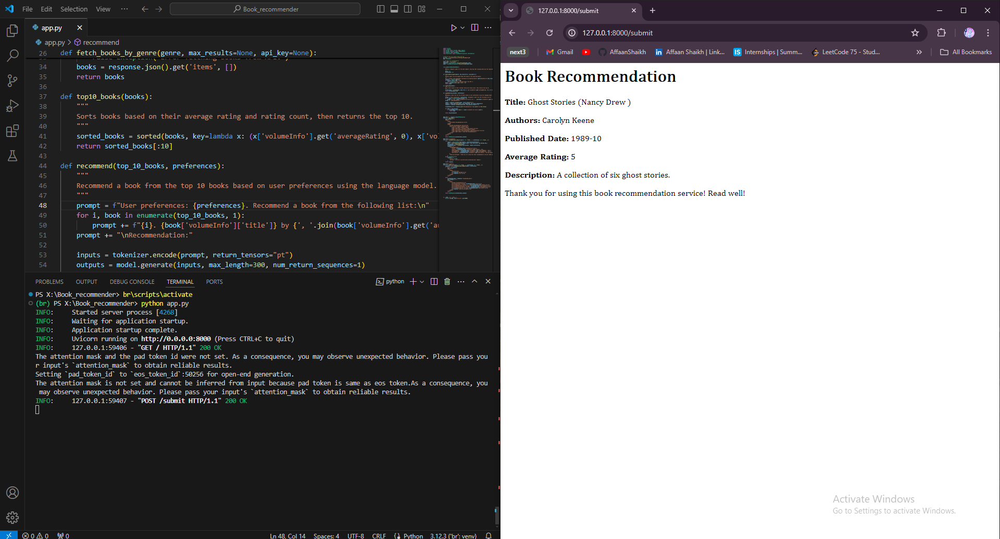

### SETUP
- Put your Google Books API key in .env file and assign to `Google_Books_API_Key`
- run `pip install -r requirements.txt`

You can now run app with: `python app.py`

### Recommendation examples

1)  genre: horror 

    preferences: author: Stephen King, published after: 1980, average rating above: 4.1

2)  genre: fantasy

    preferences: author: J.K. Rowling, published after: 2000, average rating above: 4.5

### Output Screenshots

  

